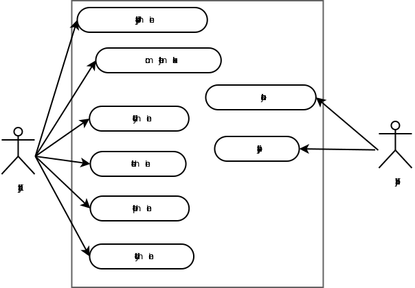

# Pistedatatallennin

## Johdanto

Järjestelmään on tarkoitus tallettaa metadataa käyttäjän vierailemista paikoista. Talletettava tieto voi olla mitä vain, minkä käyttäjä arvioi itselleen tai muille hyödylliseksi. 

Pistedatatallennin on selaimen avulla käytettävä sovellus, johon käyttäjä syöttää tietoa siitä mitä mielenkiintoista kyseisessä paikassa on. Sijainnin haun hoitaa selain ja se talletetaan tietokantaan sellaisenaan. Pisteillä voisi olla jonkinlainen säde, jotta jotkin paikat tallentuisivat "samoina" paikkoina. (tämän toteutumisesta en ole vielä oikein varma)

Pistedatatallentimella käyttäjä voi tagata paikkoja haluamillaan tageilla, ja sitten esim. listata niitä. Esimerkiksi käyttäjä voi tallettaa tiedon siitä missä on hyviä ravintoloita tai missä on vaarallisia risteyksiä.

Sovellus toteutetaan python-ohjelmointikielellä ja Flask-mikroframeworkilla, jota ajetaan Osuuskunta Sangen Oiva-palvelimella. Tietokantatalletukset tehdään Oivan PostgreSQL-tietokantaan.

Jos ehdin ja osaan, toteutan sovellukseen karttanäkymän, josta käyttäjä näkee intuitiivisesti tekemänsä tietokantatalletukset. Tämä todennäköisesti vaatii jotain javascript-säätöä.

## Käyttötapaukset

### Käyttäjäryhmät

Käyttäjä
- kuka tahansa sovellukseen rekisteröityvä henkilö. Tavallisen käyttäjän rooli

Ylläpitäjä
- käytännössä käyttäjä, mutta jolta löytyy ylläpitäjän rooli ja oikeus poistaa paikkatietoja

### Käyttötapauskuvaukset

#### Käyttäjän käyttötapaukset

Uuden käyttäjän luominen
- kuka tahansa voi luoda uuden käyttäjän

Omien tietojen muokkaus
- nimi

Tiedon syöttäminen
- rekisteröityneet ja kirjautuneet käyttäjät voivat luoda uuden paikkatiedon. Selain hakee lomakkeeseen sijainnin ja käyttäjä täyttää varsinaisen tiedon ja lisää tagit.

Tiedon listaaminen
- käyttäjä voi suodattaa tietoa tagien perusteella. Tageja voi valita useita kerrallaan tai ei yhtään (jolloin käyttäjälle listataan kaikki paikkatiedot)

Tiedon poistaminen
- käyttäjä voi poistaa sellaisen paikkatiedon, jonka omistaja hän on

Tiedon yhdistäminen
- käyttäjä voi yhdistää kaksi paikkatietoa, jolloin luodaan kolmas paikkatieto, joka laskee näiden kahden pisteen puolivälin koordinaattien perustella ja se asetetaan uuden paikkatiedon sijainnksi. Kumpaakaan näistä paikkatiedoista ei poisteta, mutta niitä ei myöskään näytetä listauksissa.

#### Ylläpitäjän käyttötapaukset

Käyttäjän poistaminen
- käyttäjiä kannattaa poistaa vain jos ne ovat häiriköiviä, esim spämmereitä.

## Järjestelmän tietosisältö
![tietosisältökaavio] (tietosisältökaavio.png)

### paikka

                               Table "public.paikka"
            Column    |  Type   |                      Modifiers
         --------------+---------+-----------------------------------------------------
         id           | integer | not null default nextval('paikka_id_seq'::regclass)
         koordinaatti | point   | not null
         omistaja     | integer | 
         luotu        | date    | default now()
         yhdpaikkaan  | integer | 

postgreSQL tarjoaa pistedatatyypin, jota käytetään koordinaattien tallettamisessa. Omistaja on integer, joka viittaa käyttäjän id:hen. Yhdpaikkaan on mergeämistä varten. Jos yhdpaikkaan ei ole null, kyseistä paikkaa ei näytetä listauksissa.

### kuvaus

                                  Table "public.kuvaus"
          Column |           Type           |                      Modifiers                      
         --------+--------------------------+-----------------------------------------------------
         id     | integer                  | not null default nextval('kuvaus_id_seq'::regclass)
         paikka | integer                  | not null
         kuvaus | text                     | not null
         luotu  | timestamp with time zone | default now()

Paikka viittaa paikan id:hen. Kuvaus on mitä tahansa paikkaan liittyvää kuvailevaa tekstiä.

### käyttäjä

                                   Table "public.kayttaja"
         Column  |           Type           |                       Modifiers                       
          -------+--------------------------+-------------------------------------------------------
        id       | integer                  | not null default nextval('kayttaja_id_seq'::regclass)
        nimi     | text                     | 
        tunnus   | text                     | not null
        salasana | text                     | 
        luotu    | timestamp with time zone | default now()
        muokattu | timestamp with time zone | default now()
        rooli    | rooli                    | 

Nimi on käyttäjän nimi. Tunnus on käyttäjän käyttäjätunnus. Rooli on enum, joka voi olla joko "tavis" tai "admin".

### tagi

                         Table "public.tagi"
          Column |  Type   |                     Modifiers                     
         --------+---------+---------------------------------------------------
          id     | integer | not null default nextval('tagi_id_seq'::regclass)
          tagi   | text    | not null
          lang   | text    | 

tagi on yleensä lyhyt, yhden sanan mittainen kuvaileva sana, esimerkiksi "ravintola" tai "uimapaikka"

### paikkatagi

        Table "public.paikkatagi"
          Column |  Type   | Modifiers 
         --------+---------+-----------
          paikka | integer | 
          tagi   | integer | 

paikka ja tagi viittaavat paikka ja tagi -taulujen id-kohtiin.

## Relaatiotietokantakaavio

![tietokantakaavio] (tietokantakaavio.png)

